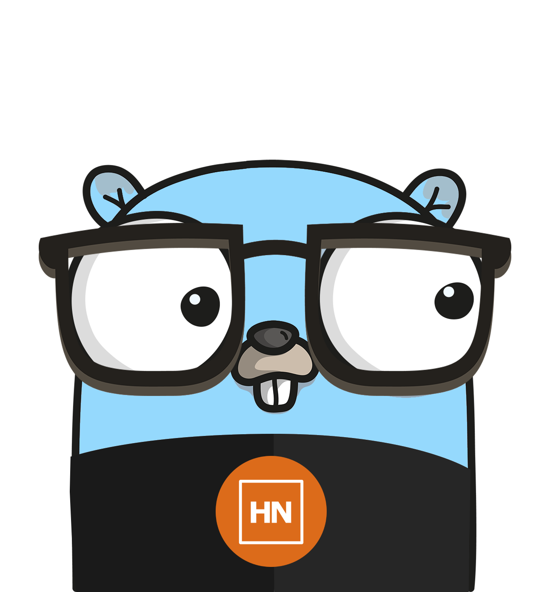

# GoHN — Hacker News API Wrapper for Go

<div align="center">
<a href="https://pkg.go.dev/github.com/alexferrari88/gohn/pkg/gohn"></a>
</div>
<div align="center">

</div>

GoHN is a wrapper for the [Hacker News API](https://github.com/HackerNews/API) for Go, inspired by the excellent [go-github](https://github.com/google/go-github) library.

It facilitates the use of the API by providing a simple interface to the API endpoints.

## Features 🚀

- Get the top/new/best/ask/show/job stories
- Retrieve all comments (with metadata) for a story using goroutines to speed up the process
- Retrieve the comments ordered as they appear in the story on the website
- Apply filters to retrieved items (stories, comments)
- Can be used with a custom http.Client instance (to use a proxy, for example)

## Usage 💻

Refer to the [GoDoc](https://pkg.go.dev/github.com/alexferrari88/gohn/pkg/gohn) for the full API reference.

### Example

Refer to [example/main.go](example/main.go) for a full example on how to retrieve the top stories' IDs and the all the comments for the first one.

```go
    // Instantiate a new client to retrieve data from the Hacker News API
    hn := gohn.NewClient(nil)

    // Use background context
    ctx := context.Background()

    // Get the top 500 stories' IDs
    topStoriesIds, _ := hn.Stories.GetTopIDs(ctx)

    var story *gohn.Item
    // Retrieve the details of the first one
    if len(topStoriesIds) > 0 && topStoriesIds[0] != nil {
        story, _ = hn.Items.Get(ctx, *topStoriesIds[0])
    }

    if story == nil {
        panic("No story found")
    }

    // Print the story's title
    fmt.Println("Title:", *story.Title)

    // Print the story's author
    fmt.Println("Author:", *story.By)

    // Print the story's score
    fmt.Println("Score:", *story.Score)

    // Print the story's URL
    fmt.Println("URL:", *story.URL)

    fmt.Println()
    fmt.Println()

    if story.Kids == nil {
        fmt.Println("No comments found")
        return
    }

    // Retrieve all the comments for that story
    // UnescapeHTML is applied to each retrieved item to unescape HTML characters

    commentsMap, err := hn.Items.FetchAllKids(ctx, story, processors.UnescapeHTML())

    if err != nil {
        panic(err)
    }
    if len(commentsMap) == 0 {
        fmt.Println("No comments found")
        return
    }

    fmt.Printf("Comments found: %d\n", len(commentsMap))
    fmt.Println()

    // Create a Story struct to hold the story and its comments
    storyWithComments := gohn.Story{
        Parent:          story,
        CommentsByIdMap: commentsMap,
    }

    // Calculate the position of each comment in the story
    storyWithComments.SetCommentsPosition()

    // Get an ordered list of comments' IDs (ordered by position)
    orderedIDs, err := storyWithComments.GetOrderedCommentsIDs()

    if err != nil {
        panic(err)
    }

    // Print the comments
    for _, id := range orderedIDs {
        comment := commentsMap[id]
        if comment.Text != nil {
            fmt.Println(*comment.Text)
            fmt.Println()
        }
    }
```

## Semantic Versioning 🥚

As this library is not yet in version 1.0.0, the API may have breaking changes between minor versions.

## Contributing 🤝🏼

Feel free to fork this repo and create a PR. I will review them and merge, if ok.

## License 📝

[MIT](https://choosealicense.com/licenses/mit/)
